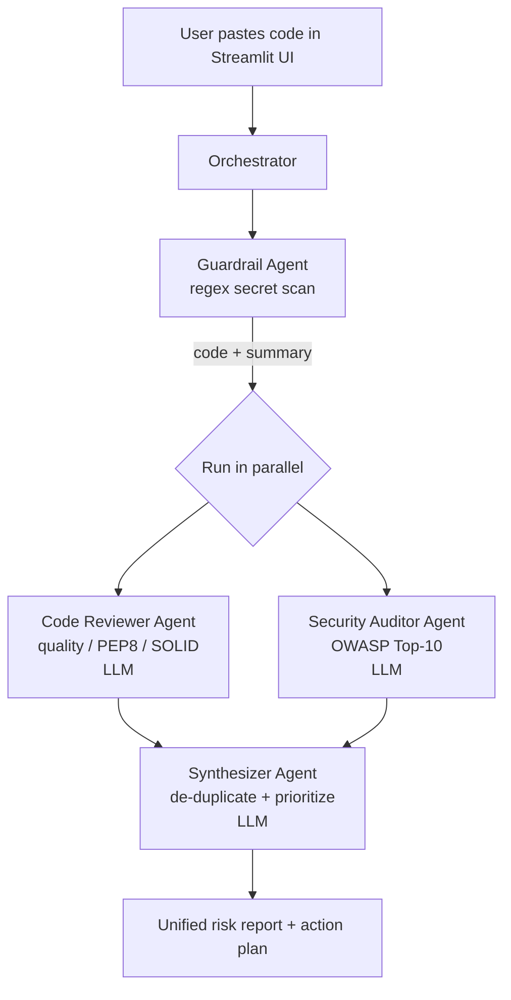

# 🛡️ SentinelReview : Multi-Agent Code Review & Security Audit

A hierarchical, parallel multi-agent system that reviews source code for
quality and OWASP Top-10 security issues, then produces a single
prioritized action plan. 
---

## What it does

Paste any code snippet into the UI and five specialized agents collaborate to
produce a unified risk report in ~10 seconds.

---

## 🧠 Architecture



| Agent | Role | Tech |
|---|---|---|
| **Orchestrator** | Routes state, runs agents sequentially or in parallel | `ThreadPoolExecutor` |
| **Guardrail** | Regex secret scan (AWS keys, private keys, DB URIs, bearer tokens…) runs before any LLM call so secrets never leave the machine | Pure Python regex |
| **Code Reviewer** | Quality, readability, SOLID, naming, edge cases | Claude 3.5 Sonnet |
| **Security Auditor** | OWASP Top-10, path traversal, eval/exec misuse, insecure randomness | Claude 3.5 Sonnet (temp 0.1) |
| **Synthesizer** | Merges findings, de-duplicates, outputs Overall Risk + Action Plan | Claude 3.5 Sonnet |

### Communication pattern
Hierarchical control + parallel fan-out. The Orchestrator owns the pipeline
state; the Reviewer and Auditor run in parallel to cut latency roughly in half.

### Safety & guardrails
- **Local-first secret scanning** — secrets are detected and masked before any prompt is sent to Anthropic.
- **Structured system prompts** with fixed output sections (Summary / Issues / Remediation) reduce prompt-injection surface.
- **Dataclass result types** (`GuardrailResult`, `ReviewResult`, `AuditResult`, `SynthesisResult`) ensure downstream agents only consume typed fields, not free-form LLM text.
- **Error isolation** — any agent failure is captured in `PipelineResult.errors` without crashing the pipeline.

---

## 🚀 Run locally (beginner-friendly)

### 1. Prerequisites
- Python **3.10+** — https://www.python.org/downloads/ 
- An Anthropic API key — https://console.anthropic.com/settings/keys

### 2. Clone & set up
```bash
git clone https://github.com/arifshaik251/sentinel-review.git
cd sentinel-review

# create & activate a virtual environment
python -m venv venv
# Windows PowerShell:
venv\Scripts\Activate.ps1
# macOS / Linux:
source venv/bin/activate

pip install --upgrade pip
pip install -r requirements.txt
```

### 3. Add your Anthropic key
```bash
cp .env.example .env        # Windows: copy .env.example .env
# then edit .env and paste your real key
```

### 4. Launch
```bash
streamlit run app/main.py
```
Opens at **http://localhost:8501**.

---

## 🧪 Tests

```bash
pytest -v
```

~35 unit + integration tests with mocked LLMs cover:
- secret-pattern detection (AWS, GitHub, bearer, private keys, DB URIs)
- pipeline happy path + parallel/sequential modes
- error propagation from any agent to `PipelineResult.errors`

---

## ☁️ Deploy to Azure App Service (Free F1 tier)

1. Push this repo to **GitHub** (public).
2. Azure Portal → **Create → Web App** → Linux, Python 3.11, **F1 (Free)**.
3. **Configuration → General settings → Startup Command:** `bash startup.sh`
4. **Configuration → Application settings:** add `ANTHROPIC_API_KEY`.
5. **Deployment Center → GitHub → main branch → Save.**
6. Open `https://<your-app>.azurewebsites.net` — first boot takes ~30 s.

See the full walkthrough in the project write-up.

---

## 📁 Project layout
```
sentinel-review/
├── app/
│   └── main.py             # Streamlit UI entrypoint
├── agents/
│   ├── orchestrator.py     # pipeline controller
│   ├── guardrail.py        # regex secret scanner
│   ├── reviewer.py         # code-quality agent
│   ├── auditor.py          # OWASP security agent
│   └── synthesizer.py      # unified-report agent
├── tests/                  # pytest suite (mocked LLMs)
├── requirements.txt
├── REPORT.md               # 1–2 page project report (required deliverable)
├── startup.sh              # Azure Linux startup command
├── .deployment             # Azure build config
├── .env.example
└── README.md
```


